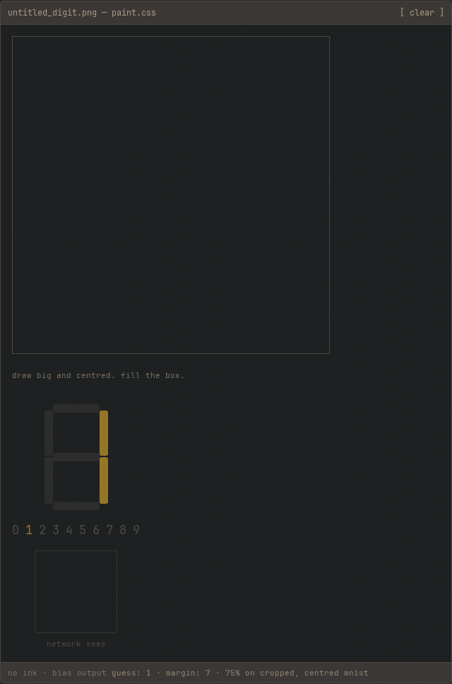

# htmlnet

a neural network built out of logic gates in html + css. draw a digit, css guesses it.

[try the demo](https://diegoperez956.github.io/html-neural-net/) ·
[no javascript](https://diegoperez956.github.io/html-neural-net/no-js.html) ·
[how it works](https://diegoperez956.github.io/html-neural-net/how-it-works.html)



hand-picked drawing, not a benchmark.

## run it

open `dist/index.html`. no server, no wasm, no network.
firefox 128+ or chromium 111+.

the one `<script>` only turns drags into checkbox clicks.
delete it, or open `dist/no-js.html`, and clicking cells runs the same inference.

rebuild and test:

```bash
make build
python3 -m venv .venv
.venv/bin/pip install -r requirements-dev.txt
.venv/bin/python -m playwright install chromium firefox
make test PYTHON=.venv/bin/python
```

`make train` retrains and overwrites the weights. you don't need it to run or test anything.

## how it works

checkboxes are bits. css custom properties are wires. gates are plain css math:
`NOT = 1−a`, `AND = min`, `OR = max`, `XOR = max−min`.
adders, multipliers, neurons, and argmax are all built from those gates at build time.

the canvas is 14×14 checkboxes. gates thicken your stroke and squash it to 7×7.
a linear classifier scores ten digits, a gate tournament picks the winner,
and gates light the seven-segment display.

css can multiply on its own with `calc()`. building it from gates is the point, not a workaround.

rust in `gen/` writes the page and `train/` trains the weights. neither ships.
the page is about 1.6 MB with 6,834 css signals.

## how good is it

not very. the saved model scores 75.42% on the cropped, centred 10k mnist test set.
it gets 8/10 2×-upscaled canonical glyphs and 6/10 seven-segment-shaped 1-cell-wide glyphs.
the page doesn't recenter your drawing, so draw big and in the middle.

## prior art

css logic gates and adders go back to 2011.
GrahamTheDev built a single-layer css classifier in 2023.
i found nothing earlier that builds multiplication from gates alone or runs a hidden layer in css.

## license

MIT
