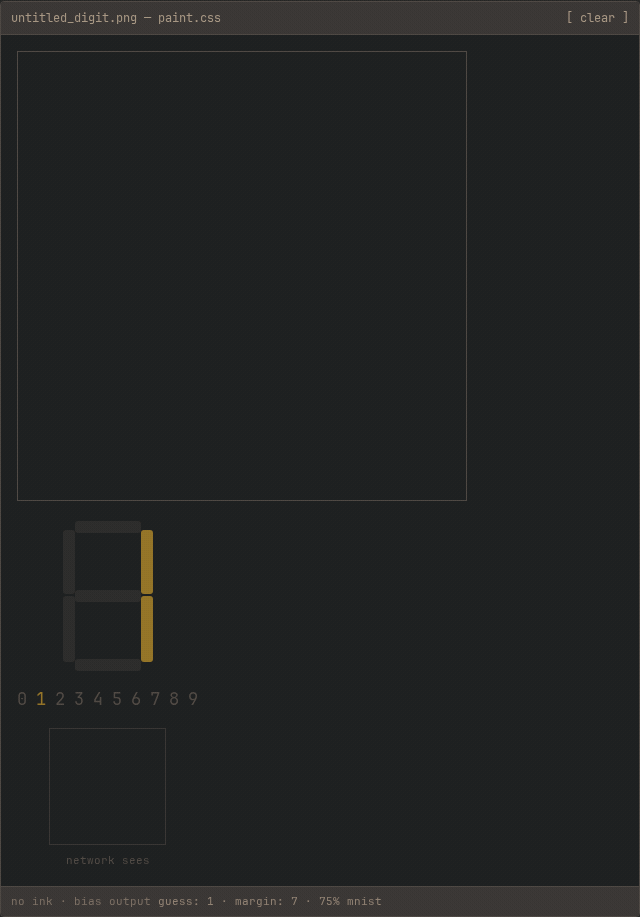

# htmlnet

a neural network built from logic gates and arithmetic circuits in html + css.
inference runs in css. one optional javascript shim handles drag input.

[try the demo](https://diegoperez956.github.io/html-neural-net/) ·
[no javascript](https://diegoperez956.github.io/html-neural-net/no-js.html) ·
[how it works](https://diegoperez956.github.io/html-neural-net/how-it-works.html)

 

these are two hand-picked drawings, not an accuracy benchmark.

Open `dist/index.html` offline and draw a digit on the 14×14 canvas.
CSS gates thicken and downsample the stroke, calculate ten class scores,
and decode the winner onto a seven-segment display. There is no WASM,
network request, or server. Delete the `<script>` tag and click cells
individually to run the same inference.

Under the drawing area, separate examples show gates, arithmetic, a 2-2-1
XOR network, and a trained 3×3 bar classifier.

```
HTML checkbox state → bits → logic gates → adders → multiplication
→ dot product → matrix×vector → neurons → XOR MLP
```

The circuit builders compose named signals, rather than enumerating complete input truth tables. The numbered sections are separate examples built with those functions. The XOR network does not feed the digit classifier.

## Read this first

- [How it works, with worked math](docs/HOW_IT_WORKS.md)
- [Filming walkthrough for YouTube](docs/VIDEO_WALKTHROUGH.md)
- [Implementation audit, including historical shortcuts](docs/IMPLEMENTATION_AUDIT.md)
- [Browser-readable explanation](dist/how-it-works.html)
- [50-minute silent Manim study video](video/README.md)
- [Next-chat knowledge-test handoff](docs/STUDY_HANDOFF.md)

## Demo

```bash
make build   # generates dist/index.html from checked-in weights
xdg-open dist/index.html
```

Or open the prebuilt `dist/index.html`. Firefox 128+, Chromium 111+.

For **no JavaScript at all**, open `dist/no-js.html`. It uses native clicks
instead of drag painting and contains the same calculation signals.
`make build` generates both versions. The generator also accepts `--no-js`:

```bash
./gen/target/release/htmlnet-gen /tmp/htmlnet-no-js.html --no-js
```

### github pages

in the repo settings, set pages → source to **github actions**.
the pages workflow builds and deploys `dist/` on pushes to `main`.
it also accepts manual runs. it does not retrain the network.

### record the gifs

with the dev dependencies, playwright chromium, and ffmpeg installed:

```bash
make build
python3 scripts/record_demos.py
```

the recorder uses real pointer drags in headless chromium against `dist/index.html`.
it checks the final digit and segment signals, then writes optimized gifs to `docs/media/`.

## Why this is interesting

Two independent curiosities:

1. **Gate-derived mode (the absurd one).** Gates are named bit identities
   over native CSS arithmetic (`NOT=1−a`, `AND=min`, `OR=max`,
   `XOR=max−min`). Half adders, full adders, ripple carries, AND partial
   products, two's-complement negation, signed sums, and threshold
   activations are all composed from those gates at build time. The XOR
   network uses 177 gates. The whole page has 6,834 registered signals,
   including inputs, aliases, display views, a
   perceptron-trained 3×3 glyph classifier and a bit-plane-popcount 10-class
   MNIST digit classifier fed by gate-built stroke dilation and 2×2
   OR-downsample from a 14×14 paint canvas, with a gate argmax and
   seven-segment decode.
2. **Native-CSS mode.** The same XOR network and two matrix rows use
   eight direct arithmetic declarations, excluding display views.
   The demo shows both modes producing identical outputs.

CSS can multiply two numeric runtime values with
`calc(var(--a) * var(--b))`. Earlier versions of this README said otherwise;
that claim was wrong. Both browser engines now test native multiplication
against the gate multiplier. Gate mode is an educational construction,
not a workaround for a multiplication restriction.

## Why XOR

A single linear neuron cannot learn XOR; a two-neuron hidden layer can.
The page ships a 2-2-1 threshold MLP with integer weights:

```
h1 = step(+2x1 − 2x0 − 1)
h2 = step(−2x1 + 2x0 − 1)
out = step(+2h1 + 2h2 − 1)
```

All four input states are verified against an independent Python
reference, including hidden preactivations. Weights ±2 are deliberate: a
power-of-two magnitude times a bit needs no general multiplier. The
builder still emits masking gates and two's-complement negation for
negative products, then sums at 4-bit signed width.

## Is HTML actually doing the math?

Precisely: **the browser's style engine is doing the math, on a
dependency graph that the HTML/CSS artifact describes.**

* HTML supplies interactive state (checkbox checkedness) and the DOM tree.
* CSS supplies the computation graph: `@property`-registered integer
  custom properties whose declarations reference each other via
  `var()`. The style engine evaluates `calc()`/`min()`/`max()`,
  propagates values along the dependency DAG, and invalidates/recomputes
  when a checkbox changes.
* The browser provides arithmetic, selector matching, and style updates.
  The project does not build those operations from lower-level gates.
* We do **not** claim "HTML performs matrix multiplication" or that CSS is
  a CPU. The netlist is combinational, feed-forward, and fixed — which is
  exactly what a trained MLP's inference graph is, so the honest
  description is also the accurate one: *neural-network inference
  implemented with HTML and CSS.* The network itself, the display, and
  every readout are computed with zero JavaScript; the page's one
  `<script>` is an input shim that turns pointer drags into checkbox
  toggles. It calculates pointer geometry, not network outputs.

Build-time Rust (`gen/`, `train/`; never shipped) elaborates the circuit,
generates repetitive CSS, and computes references. The runtime artifact is
flat and deterministic.

## Correctness

```bash
python3 -m venv .venv
.venv/bin/pip install -r requirements-dev.txt
.venv/bin/python -m playwright install chromium firefox
make test PYTHON=.venv/bin/python
```

`make test` builds from the checked-in weights, runs 15 Rust tests and 94
Python tests: 40 browser tests per engine, 5 runtime static checks, 3 history
inventory tests, and 6 video-math tests. The 16 abstract browser base classes
are skipped, not missing browser coverage. Missing browsers are failures,
not silent skips. `make train` is separate: it retrains and overwrites both model files
and can download MNIST. No retraining is needed to open or test the demo.

* static: exactly one `<script>` (the input shim, checked for size and for
  absence of network APIs, plus a hash of the reviewed code), no handlers, no `javascript:`, no
  WASM, no external resource;
* inference with page JavaScript disabled and with the script removed;
* deterministic rebuilds (byte-identical);
* rendered binary bit order and seven-segment colors;
* gates exhaustively; half adder 4 states; full adder 8;
* 2-bit adder & 2×2 multiplier 16 states; 4-bit adder **256 states**;
* dot product 16 states; matrix-vector 4; neuron preactivation+activation;
* XOR MLP: 4 states, hidden preactivations and hidden outputs included;
* Mode B: same outputs from native arithmetic;
* trained classifier: 9 training exemplars + 32 random states against an
  independent reference computed from `scripts/weights.json`;
* drawn-digit classifier: gate-level dilation + OR-downsample vs a Python
  pipeline reference for hand-picked 14×14 patterns, then gate argmax +
  seven-segment decode checked against an independent reference computed
  from `scripts/weights_mnist.json`, plus registered-view spot checks and
  rendered-output checks (paint canvas shows no idle grid and draws rounded
  ink blobs; the pixelated "network sees" preview reads the post-downsample
  gate bits).

M11's classifier is trained on real MNIST (`train/src/mnist.rs`,
deterministic): pixels binarize, crop to the digit's bounding box,
pad to a centered square, area-resample to a 14×14 coverage grid (the
canvas resolution), dilate one round, and OR-reduce each 2×2 block to the
7×7 grid the classifier consumes — the trainer simulates the exact gate
pipeline the browser runs. Hyperparameters (cell threshold, shuffle seed,
quantization scale, glyph-augmentation accept/reject) are selected against
a drawn-style validation proxy — held-out MNIST images with thickened
strokes and a tighter, canvas-filling crop, standing in for how a person
actually drags a stroke — not against downsampled-MNIST accuracy directly
(see D-010/D-011 in `docs/DECISIONS.md`; the block-OR threshold T=1 is
fixed in the current generator, but the architecture was chosen after
inspecting glyph acceptance results). An 8-epoch perceptron quantized to
weights in [-3,3] scores 75.42% on the full 10k MNIST test set, 8/10
2×-upscaled canonical drawn glyphs (misses 6 and 9), and 6/10 thin-stroke
canvases (what a 1-cell-wide drag looks like; misses 1, 2, 6, 9). That's a
linear model over a lossy 7×7 binary grid selected for drawn-digit
fidelity rather than MNIST accuracy, and the runtime page does no
normalization — draw large and centered, matching the training
preprocessing, or accuracy drops. The 8/10 and 6/10 results are
acceptance-conditioned, not untouched estimates of accuracy on new drawings.
The current training split is 50k training images and 10k validation images.
This review verified inference against the saved weights, not the recorded
MNIST training accuracy.

## Browser support

Chromium 111+ / Firefox 128+ (needs `:has()`, `@property`, and
`color-mix()` for LED styling). Safari 16.4+ should work but is **not
tested in this repo**. The local suite was run with Chromium 149 and Firefox
151. The github pages workflow builds and deploys the demo; it does not
run the test suite. The full demo is ~1.62 MB, 6,834 registered signals. See `docs/LIMITS.md` for
the measured scaling story.

## Prior art (and what this adds)

See `docs/PRIOR_ART.md` for the dated survey and sources.

* CSS-only logic gates and adders exist since 2011 (SLaks, Amit Sheen,
  checkbox hacks). CSS Turing completeness was settled (Cherlin 2022).
* GrahamTheDev (2023) shipped a CSS-only *single-layer* dot-product
  classifier. The closest real predecessor.
* A full 8086 in CSS exists (Lyra Rebane 2026) on newer CSS features.

The honest distinctives, stated as absence-of-evidence: no prior project
found builds multiplication/dot-products from a **gate-only netlist**, and
none runs a **hidden-layer (2-2-1) network** whose hidden activations are
consumed downstream inside CSS. We don't claim more than that.

## Repository

```text
gen/                    Rust circuit compiler + demo generator -> dist/index.html
train/                  Rust trainer -> scripts/weights*.json
scripts/audit_history.py historical runtime-script and selector inventory
benchmarks/*.csv        dated historical measurements; probe scripts removed
tests/test_runtime.py   two-engine arithmetic and rendering checks
experiments/            prototypes, per-worktree findings
docs/                   COMPUTATION_MODEL, ARCHITECTURE, PRIOR_ART,
                        DECISIONS, LIMITS, ADVERSARIAL_REVIEWS
```

## Limitations

Fixed, tiny, low-precision, inference-only. No training, no feedback, no
recurrence in this fixed custom-property graph. Gate-mode multiplication
uses a circuit by choice, with roughly quadratic size growth in operand
width. Numeric native CSS multiplication is available. Every
honesty boundary is spelled out in `docs/COMPUTATION_MODEL.md`.

## License

MIT
